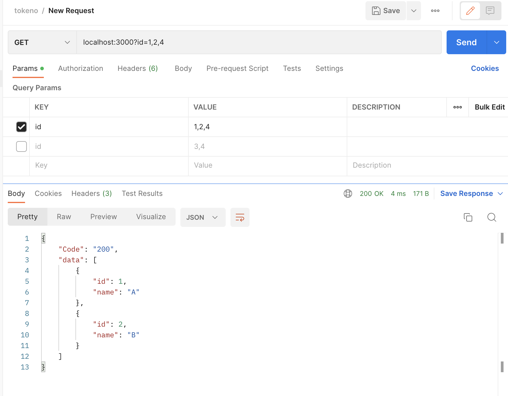
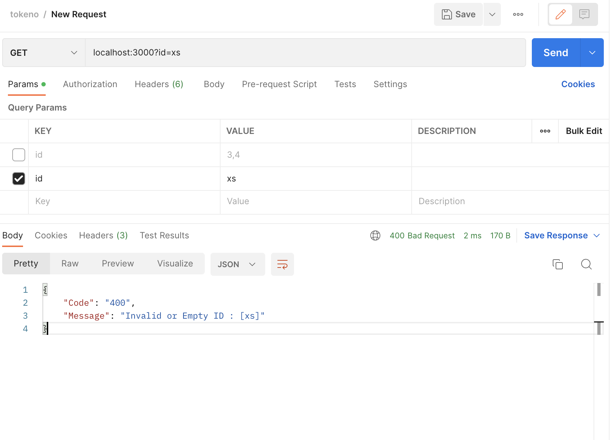

# tokeno
Basic API without library

# Run Apps

To run the application, run the command from base folder:
```go run main.go```

it will run in port 3000 by default
Result :





# Run unit tests

To run the tests , run the command from base folder:
```go test ./...```

